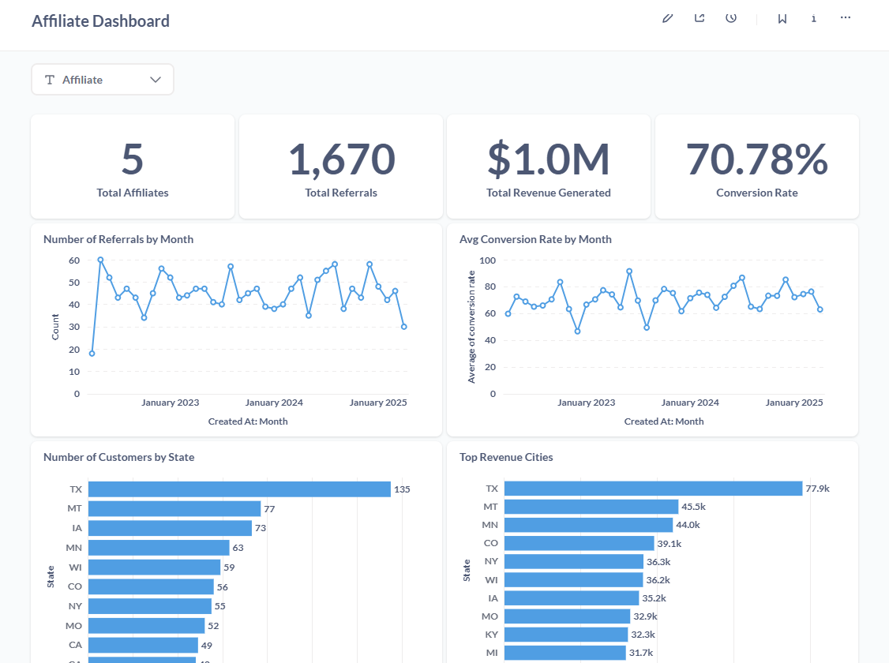

# Django Metabase Codebase

***Disclaimer: This codebase is not suitable for production and is solely for the purpose of demonstration at the Djangocon Africa 2025 Conference on my session topic: "Building Secure, User-Specific Dashboards with Django and Metabase."***

## Purpose
This codebase is for the illustration of how a combination of Metabase and Django can be used to build secure and user-specific dashboards.

## Data Source
The data used in this project was gotten from the Sample database in Metabase with some modifications made to it. These modifications include:
- Added a new affiliate table

- Added a referral column to the 'People' table with randomly generated values that matched the affiliate_id values in the affiliate table.

## Prerequisites
- Python 3.10+
- Docker& Docker Compose
- Postgres database
- Git

## Setup
- Clone the git repository

``` bash
git clone https://github.com/Nancy9ice/django_metabase_codebase.git
```

- get into the root folder

``` bash
cd django_metabase_codebase
```

- Setup a virtual environment and activate the virtual environment

- Install the libraries in the requirements.txt

```bash
pip install -r requirements.txt
```

- Create necessary tables and insert data by running the scripts in the [sql_scripts](sql_scripts) folder.

- Setup Metabase
    - Get into the Metabase directory
    ```bash
    cd metabase
    ```

    - Run the Metabase docker container
    ```bash
    docker compose up -d
    ```

    - Add your postgres database to Metabase as a new database

    - Create a dashboard similar to this and ensure it has a filter

    

    - Follow this [guide](https://www.metabase.com/docs/latest/embedding/static-embedding) to publish the static embed for the dashboard.

    - Ensure that you indicated the filter to be a locked parameter as shown in the image below. Also, ensure that the dashboard id in line 10 (in image below) matches the id in the [affiliate_dashboard views.py](django_metabase/affiliate_dashboard/views.py)

    

- Now that Metabase is fully setup, add a .env file in the root folder assigning the correct values to the following variables
```bash
METABASE_SITE_URL= # This is the url of the metabase application
METABASE_SECRET_KEY= # This is in the static embed of the dashboard
DJANGO_SECRET_KEY=
```

Follow this [guide](https://how.dev/answers/how-to-generate-a-django-secretkey) to generate the Django secret key.

## Running the Demo

- Change directory into the django_metabase folder (the one in the root folder) if you're still in the metabase folder.
```bash
cd ../django_metabase
```

- Run DB migrations
```bash
python manage.py makemigrations
```

- Create the authorized users (eg. mary_osei) in the Django Admin page (http://localhost:8000/admin/)

- Launch the application
```bash
python manage.py runserver
```

- Access the application URL of one of the affiliates (http://localhost:8000/affiliate_dashboard/Mary%20Osei/). Then login with the credentials you created for this user at the admin page.

- A successful login should show this:


- 


